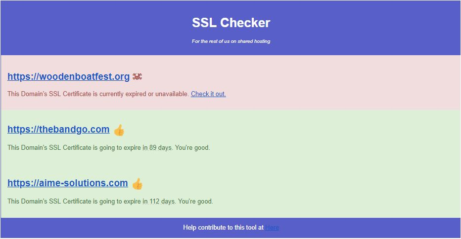

# What is this?
Hello!
I wrote this simple package that will email you a sorted table of your SSL domains on whatever interval you set the cron task at (suggest 1st and 15th of month).

This looks like below:



# Get Started
Its easy to get started. It is suggested you do this over SSH and have 
 [Composer](https://getcomposer.org//) already installed on the server. This file should not be in any public directory and will typically sit in the root directory of your server.

## Clone Repo
```
cd ~/
git clone https://github.com/timothycarambat/certcheck.git
cd certcheck
```

## Install Dependencies
Currently the dependencies are Carbon and PhpMailer.
```
#~/certcheck/
composer install --no-dev
```

## Configure Your Settings
using your choice of editor ...
```
#~/certcheck/certcheck.php
//input all your SSL domains here that you want to recieve a report on.
$urls =[
	"https://my-ssl-site.com",
];

....

$mail->Host = 'your.host.com'; //Enter your Host Here
$mail->SMTPAuth = true;
$mail->Username = 'sslchecker@example.com'; //Set Email accunt username
$mail->Password = 'hunter2'; //Set Secret Pass
$mail->SMTPSecure = 'ssl';
$mail->Port = 465; //Make sure port is correct for server

//Recipients
$mail->setFrom('SSLChecker@example.com', 'SSLChecker'); //Set the FROM email
$mail->addAddress('me@example.com'); //Set to your email

```

## Setup Cron
```
#setup for 1st and 15th of month
0 0 0 1,15 * php ~/certcheck/certcheck.php 
```

